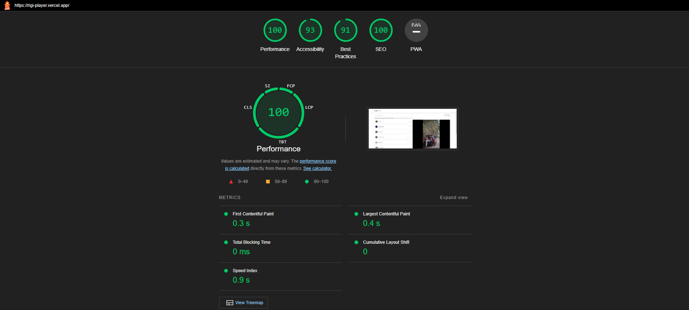

## Getting Started

Please find my submission for Assignment- React JS Developer | Rigi

To run the dev server:
```bash
npm run dev
# or
yarn dev 
```

I've also deployed it on Vercel

## Deployed on Vercel

[rigi-player.vercel.app](https://rigi-player.vercel.app/)

Please find the attached lighthouse report as well:


## Features Added

- Search feature for videos from Pexels
- Reorder playlist
- Videos will continue playing from where users left-off.
- Responsiveness
- Video feature like seek, fullscreen, play/pause, fast-forward, rewind, etc.